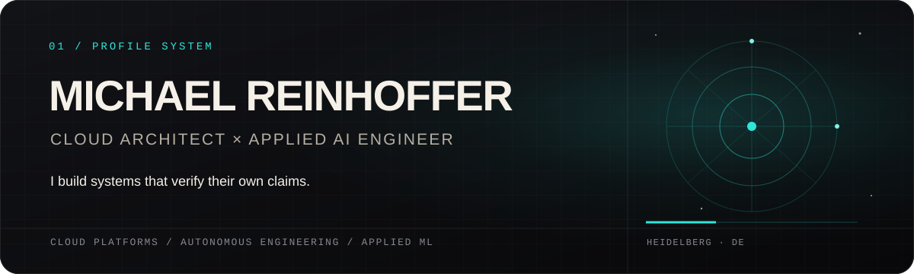

  

  <a href="https://michaelreinhoffer.lol"><strong>Portfolio</strong></a>
  ·
  <a href="https://www.linkedin.com/in/michael-reinhoffer-33b505196/">LinkedIn</a>

I work where cloud platforms, autonomous engineering, and applied machine learning meet. The common thread is verification: explicit boundaries, observable execution, reproducible evidence, and honest failure modes.

## Selected systems

### [nocturne](https://github.com/mreinhofferxd-pixel/nocturne) — autonomous development with an independent definition of done

A repository-specific harness turns a spec or checkbox backlog into isolated Claude Code sessions, one task and one atomic commit at a time. The worker proposes; the harness independently reruns the quality gate, checks the diff, protects the backlog, and rejects attempts that weaken the test suite.

**Proof:** 513 tests · Python 3.10+ · Windows, Linux, and macOS · parallel worktree lanes · resumable runs · opt-in draft PRs · never auto-merges

### [yeGPT](https://github.com/mreinhofferxd-pixel/yegpt) — a transformer built to expose its own data ceiling

A decoder-only, character-level GPT implemented directly with PyTorch tensors, autograd, and optimizers. No transformer helper classes, pretrained weights, or model libraries.

**Proof:** 1.87M parameters · 0.67MB deduplicated corpus · best validation loss 1.577 · scaling to 10.92M parameters increased memorization without improving generalization

### [Ghostline](https://github.com/mreinhofferxd-pixel/Ghostline2DRacerRL) — deterministic racing as an RL laboratory

A 2D time-trial racer, replay system, and Gymnasium-style environment built around deterministic physics and reproducible training runs.

**Proof:** the current policy laps the reference track in 3.948 seconds against a 3.959-second human benchmark

## Building privately

**Symphony** is a Jira-native orchestration system for autonomous Codex workers. It claims eligible tickets, isolates execution, handles retry and rework, opens PRs or MRs, and exposes the lifecycle through an operator dashboard.

**OpenSwing** is a local-first golf swing analyzer. Its measurement pipeline carries confidence and validity alongside every metric, and refuses to report numbers it cannot defend.

## Cloud engineering

I design and automate multi-cloud platforms across Azure, Google Cloud, and Open Telekom Cloud, usually with Terraform and Python. Current work centers on platform automation, agent infrastructure, FinOps, IAM, and reliability under DORA.

## Engineering principles

- Evidence before claims.
- Guardrails should be executable.
- Failure modes belong in the interface and the documentation.
- Automation should preserve a human decision at the point of irreversible change.
- A smaller honest system is more useful than a larger vague one.

  <a href="https://michaelreinhoffer.lol"><strong>See the systems in motion →</strong></a>

